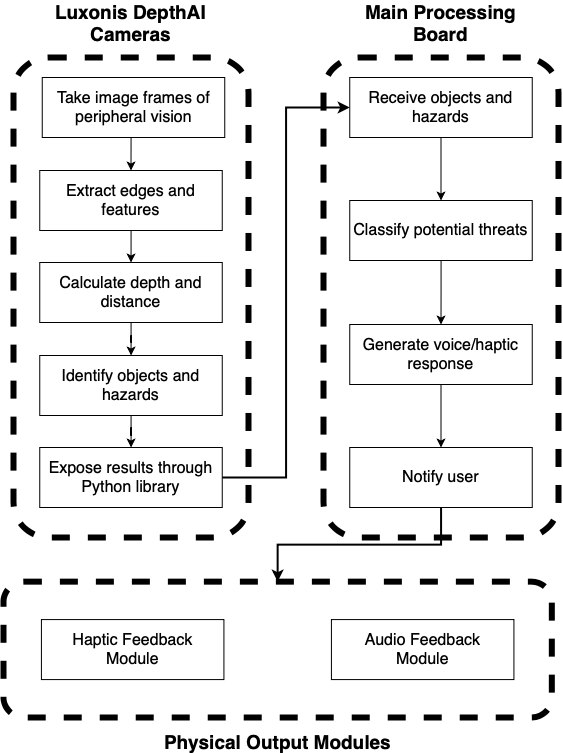

# VIAD Optics
*Visually Impaired Assistive Device* - for anyone who needs it 
## Collaborators 
- Jose Battle
- Ruben F. Carbajal
- Leanorine Lorenzano
- Zachary Dion Tan
- Axel S. Toro Vega
## VIAD Mission & Solution
VIAD aims to eliminate the high barrier of help needed for these visually impaired individuals and assist them in their daily life. 

Our device harnesses the capabilities of LIDAR sensors and advanced machine learning algorithms to enhance object recognition, enabling us to identify potential threats to the user. This innovative system is driven by a versatile microprocessor, which can be powered either by a rechargeable battery for a full day's use or by easily replaceable batteries for added convenience. Our vision includes developing a user-friendly notification system that utilizes haptic feedback and sound alert
## Architecture 

## Materials Used
- Luxonis OAK-D Pro W Camera & Sensors
- Raspberry Pi Zero 2 W
- Haptic Motor
- GoPro Batteries
- 3D Print frames & enclosure