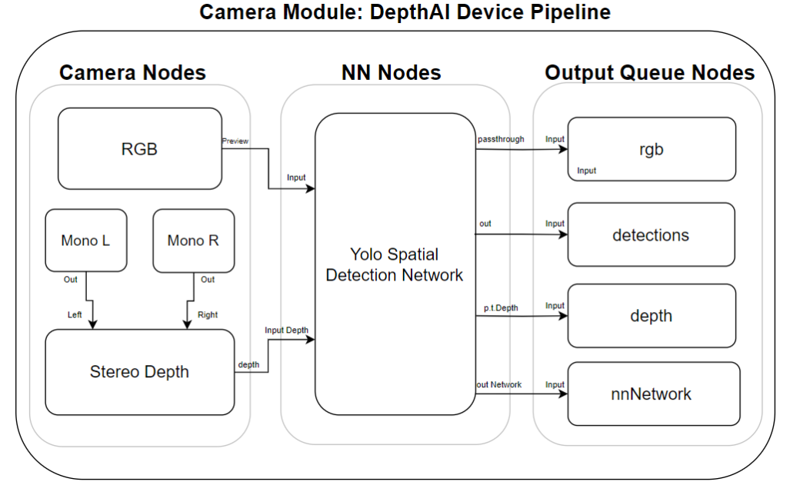

# VIAD Optics
*Visually Impaired Assistive Device* - for anyone who needs it 
## Collaborators 
- Jose Battle
- Ruben F. Carbajal
- Leanorine Lorenzana-Garcia
- Zachary Dion Tan
- Axel S. Toro Vega
## VIAD Mission & Solution
VIAD aims to eliminate the high barrier of help needed for these visually impaired individuals and assist them in their daily life. 

Our device harnesses the capabilities of LIDAR sensors and advanced machine learning algorithms to enhance object recognition, enabling us to identify potential threats to the user. This innovative system is driven by a versatile microprocessor, which can be powered either by a rechargeable battery for a full day's use or by easily replaceable batteries for added convenience. Our vision includes developing a user-friendly notification system that utilizes haptic feedback and sound alert

## Camera Architecture

## Software Architecture 

## Hardware Architecture

## Software Used
#### Helpful Repos we used:
- depthai python api: [Here](https://github.com/luxonis/depthai-python)
- depthai experiments: [Here](https://github.com/luxonis/depthai-experiments)
- Luxonis API for creating the image capturing, creating a neural network, object recognition: [Here](https://github.com/luxonis/depthai)
  - Some of the Pre Build Code Samples that can prove useful to us are:
    - Spatial Detection
- Mosquitto MQTT to message between python scripts

## Materials Used
- Camera & Sensors: Luxonis OAK-D Pro W (OV9782 Image Sensor)
- Microcontroller: Raspberry Pi Zero 2 W
- Haptic Motor: Adafruit Vibrating Mini Motor Disc
- Speakers: SC400408-2u
- Amplifier Module: Comimack TDA 1308 Stereo Headphone Amplifier
- Power Supply: Xiaomi Mi Power Bank 3 Ultra Compact
- Frames: Form labs tough 2000 resin

